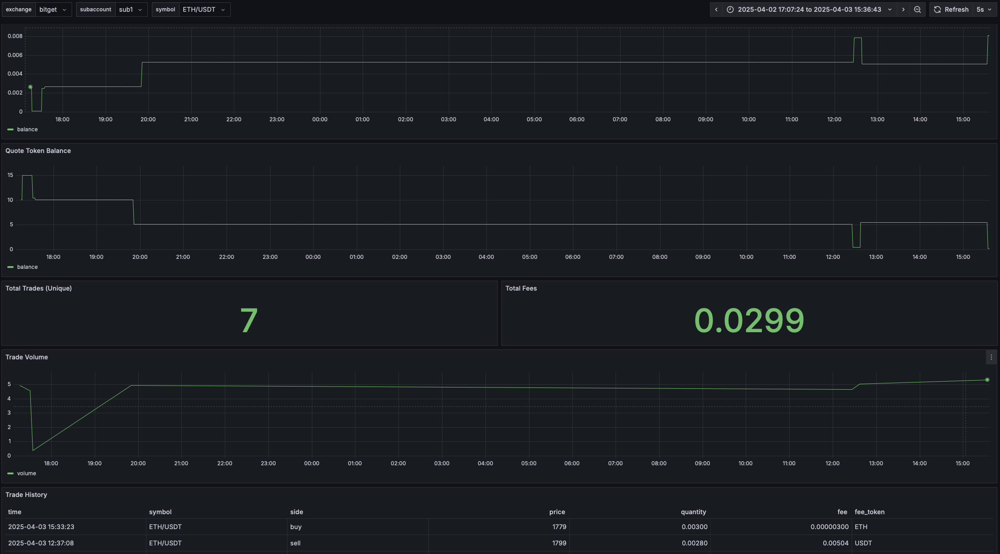

# 📊 Crypto Monitor Dashboard

A real-time, customizable crypto dashboard built with **Grafana**, **PostgreSQL**, and the **CEX's API**.

## ✨ Features

- Tracks token balances and trading PnL per symbol (e.g. `ETH/USDT`)
- Supports multiple exchanges and subaccounts
- Automatically detects trading pairs and updates variable lists
- Visualizes:
  - Base/Quote token balances
  - Trade volume (price × quantity)
  - Total fees and trade counts
  - Trade History
- Optimized for **TimescaleDB** for time-series performance
- Auto-refresh every 30s, works across any timeframe (past minutes, days, or months)

## 📦 Tech Stack

- Python (data collection)
- PostgreSQL + TimescaleDB
- Grafana 11+
- CEX's API

## 📸 Preview

---

Pull requests and feedback are welcome!
